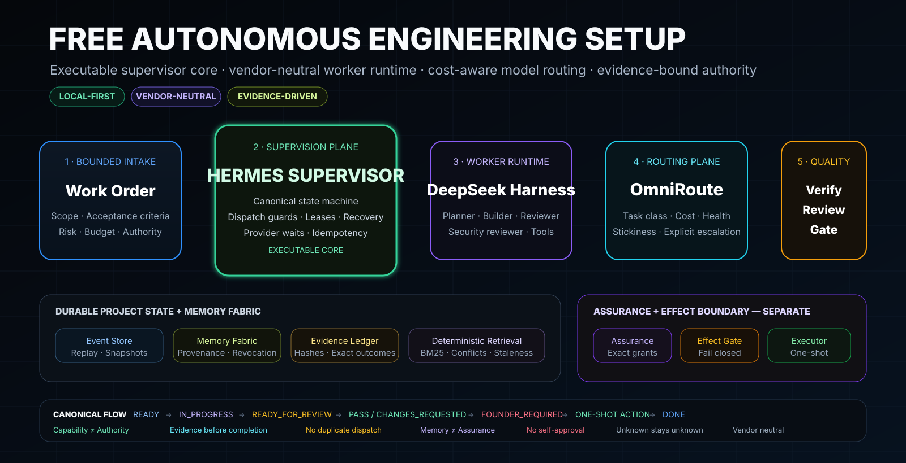
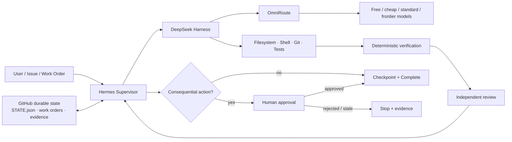

# Free Autonomous Engineering Setup

Maintained by **Ömer Coskun** — [LinkedIn](https://www.linkedin.com/in/oemer-coskun53). Lineage name: **Autonomous Engineering Reference V1** (the public evolution of AI Engineering Stack).

[Deutsch](README.de.md) · [Architecture](docs/ARCHITECTURE.md) · [Hermes Supervisor](docs/HERMES-SUPERVISOR.md) · [Installation](docs/INSTALLATION.md) · [Routing](docs/ROUTING.md) · [Security](docs/SECURITY-AND-AUTHORITY.md) · [Costs](docs/COSTS.md)



> A local-first, free-preferred autonomous coding control plane built around **Hermes Supervisor + DeepSeek Harness + OmniRoute + GitHub-backed durable engineering state**.

**Status: the control plane is executable, not only documented.** This repository ships a tested, vendor-neutral Hermes Supervisor Runtime (state machine, leases, dispatch guards, event-sourced recovery), a memory fabric with authority provenance and revocation, a deterministic effect gate with one-shot human approvals, and the DSH/OmniRoute integration contract. Every capability claim is bounded by its tests — see [`CAPABILITIES.md`](CAPABILITIES.md); threats and honest limits live in [`docs/THREAT-MODEL.md`](docs/THREAT-MODEL.md).

This repository combines the strongest reusable engineering patterns from [`WestMoneyDE/ai-engineering-stack`](https://github.com/WestMoneyDE/ai-engineering-stack) and [`WestMoneyDE/LOGOS-1`](https://github.com/WestMoneyDE/LOGOS-1) with Hermes as the supervisory control plane, [`deepseek-ai/deepseek-harness`](https://github.com/deepseek-ai/deepseek-harness) as the coding runtime and [`diegosouzapw/OmniRoute`](https://github.com/diegosouzapw/OmniRoute) as the model gateway.

The objective is not one magic free model. It is a **vendor-neutral autonomous engineering system** that decomposes work, dispatches workers, routes inference, preserves project state outside chat, verifies changes, separates review from implementation and escalates consequential actions to a human.

## Core architecture



### Responsibility split

| Layer | Responsibility |
|---|---|
| **Hermes Supervisor** | project supervision, bounded work orders, state transitions, worker dispatch, duplicate-run locks, escalation, human-gate routing |
| **DeepSeek Harness (`dsh`)** | coding-agent runtime, tools, sessions, filesystem/shell/Git execution, plugins |
| **OmniRoute** | model/provider selection, task fit, cost/quota/latency/health routing, fallback and session affinity |
| **Repository contract** | durable project truth, work orders, evidence, memory provenance, architecture/policy decisions |
| **Verification / reviewer** | deterministic checks and independent engineering review |
| **Human authority** | push/merge/deploy/production/external/destructive/financial and other consequential actions |

**Hermes is the supervisor, not the primary developer. DeepSeek Harness is the worker runtime. OmniRoute is the inference router.** Keeping those three concerns separate is a central invariant.

## Hermes supervisor state machine

Hermes should supervise compact durable project state instead of repeatedly re-reading entire repositories. The canonical machine (12 states including `PLANNED`) is machine-readable in [`spec/state-machine.json`](spec/state-machine.json) and enforced by [`src/supervisor/state-machine.mjs`](src/supervisor/state-machine.mjs) — invalid transitions, missing evidence and terminal-state exits fail closed in code.

Recommended state interface:

```text
brain/STATE.json
CURRENT-WORK-ORDER.md
.state/tasks/
.state/sessions/
.state/evidence/
```

Canonical transitions:

| State | Supervisor action |
|---|---|
| `READY` | dispatch implementation to DeepSeek Harness |
| `IN_PROGRESS` | observe; duplicate dispatch denied |
| `READY_FOR_REVIEW` | dispatch an independent review worker/session |
| `CHANGES_REQUESTED` | return bounded review findings to implementation |
| `BLOCKED` | persist blocker and stop looping |
| `WAIT_PROVIDER` | wait or use an explicitly permitted routing fallback |
| `FOUNDER_REQUIRED` | escalate to human authority |
| `APPROVED_FOR_EXTERNAL_ACTION` | execute the exact approved action once |
| `DONE` | persist evidence and close work order |
| `FAIL` / `CANCELLED` | persist exact outcome; no automatic rerun |

See [`docs/HERMES-SUPERVISOR.md`](docs/HERMES-SUPERVISOR.md).

## Best features carried forward

From **AI Engineering Stack**:

- bounded **plan → build → verify → independent review → gate** loops;
- deterministic evidence before completion;
- allow / ask / deny permission classes;
- least-privilege connectors and secret-path protection;
- independent security review instead of builder self-approval;
- durable project state instead of chat-only memory;
- source-pinned, scope-routed skills;
- explicit failure states, auditability and idempotency.

From **LOGOS-1**:

- **Capability is not authority**;
- working, episodic, semantic, procedural and evidence memory are distinct concerns;
- governance/assurance state stays outside adaptive agent memory;
- provenance, uncertainty, conflicts and supersession survive retrieval/consolidation;
- unknown remains unknown;
- failures remain failures rather than being narrated away;
- external execution is one-shot by default;
- substantive sessions leave durable recovery checkpoints.

## Routing profiles

Recommended OmniRoute routes:

| Intent | Route |
|---|---|
| Normal coding | `auto/coding` |
| Fast repository search / small fixes | `auto/coding:fast` |
| Cost-sensitive coding | `auto/coding:cheap` |
| Reliability-sensitive coding | `auto/coding:reliable` |
| Free-preferred coding | `auto/coding:free` |
| Hard reasoning / architecture | `auto/reasoning:pro` |

**Important:** `auto/coding:free` is free-preferred, not a hard $0 guarantee, because upstream filtering may fail open. Use strict budget controls / a restricted candidate pool for hard zero-spend policy. See [docs/ROUTING.md](docs/ROUTING.md).

## Quick start

Requirements: Git, Node.js 20+, npm/npx.

```bash
git clone https://github.com/WestMoneyDE/free-autonomous-engineering-setup.git
cd free-autonomous-engineering-setup
npm test        # invariant test suites + repository contract
npm run demo    # full supervised loop: PLANNED → … → DONE, locally, model-free
```

Start OmniRoute:

```bash
npx omniroute@3.8.49        # pin the version; bare 'npx omniroute' drifts
```

Default local API:

```text
http://localhost:20128/v1
```

Start DeepSeek Harness:

```bash
npx @deepseek-ai/dsh@0.1.0-rc.7 web
```

Default local UI:

```text
http://127.0.0.1:3080
```

DeepSeek Harness is currently **developer preview**; pin/review upgrades before unattended use.

Connect DSH to OmniRoute with the configuration example in [`config/dsh-omniroute.settings.example.yaml`](config/dsh-omniroute.settings.example.yaml), then configure Hermes to supervise your project's compact state interface and dispatch bounded work orders to DSH. Full sequence: [docs/INSTALLATION.md](docs/INSTALLATION.md).

## Operating loop

```text
INTENT / ISSUE
  ↓
HERMES SUPERVISOR
  ↓
BOUND WORK ORDER + RISK + ROUTING CLASS
  ↓
DEEPSEEK HARNESS WORKER
  ↓
OMNIROUTE → MODEL/PROVIDER
  ↓
BUILD
  ↓
DETERMINISTIC VERIFY
  ↓
INDEPENDENT REVIEW
  ↓
HERMES STATE TRANSITION
  ↓
HUMAN GATE IF CONSEQUENTIAL
  ↓
CHECKPOINT + COMPLETE
```

## Memory and authority

The repository is durable project truth. Runtime memory may accelerate retrieval, but it cannot become the sole copy of decisions or mint authority. This is enforced, not aspirational: the memory fabric (`src/memory/`) preserves source AND authority provenance through consolidation, propagates revocation to derived procedures, and rejects grant/credential/scope/token records outright; approvals live in a separate assurance store (`src/policy/approval.mjs`) that only human-class actors can write (tests: `tests/memory.test.mjs`, `tests/approval.test.mjs`).

```text
.state/
  tasks/
  sessions/
  evidence/
  decisions/
  memory/
  assurance/   # separate authority/governance state
```

**Capability is not authority.** Hermes, DSH and any model may propose an action; none may self-grant permission for a consequential action.

## Memory Factory and Scope Engine

The **Memory Factory** (`src/memory/factory.mjs`) is the only supported entry point into the memory fabric. Ingest, retrieval, consolidation and projection all run through it, so source *and* authority provenance, conflicts, supersession and revocation survive by construction. It is proposal-side only: it can never mint a grant, credential, scope or approval token.

The **Scope Engine** (`src/policy/scope-engine.mjs`) is the typed, restrictive contract for *what* a worker may touch. Scopes intersect and never widen, every dispatch binds the exact canonical `scope_digest` before a lease mutates, and an `ALLOW`/`NARROW` decision without a matching effective contract fails closed. Retrieval and projection are bound to the same digest, which is why remembered content cannot cross a project or role boundary.

Both are `IMPLEMENTED` and covered by `tests/memory-factory.test.mjs`, `tests/scope-engine.test.mjs` and `tests/memory.test.mjs`.

## Canonical agent surfaces

`.agents/`, `.skills/`, `.commands/` and `.claude/` are first-class, scope-gated surfaces in this repository, installed byte-identically into a target project by `scripts/init-project.mjs` with a SHA-256 `INSTALL-MANIFEST.json`. `.claude/` remains a thin adapter: commands route through the supervisor and hold no direct consequential authority (`tests/agent-surfaces.test.mjs`).

## Security Reviewer (Strix)

Security review follows the [`usestrix/strix`](https://github.com/usestrix/strix) procedure, pinned at commit `2cc816781438f2993bcbb5c8cf3f693c25380142`, license `Apache-2.0`. No Strix source is vendored and no Strix executable is installed by this repository.

The integration is an **authorization-gated contract, not an automation**: `src/security/strix-review.mjs` validates review *claims* and always returns `execution_authorized: false`. Running Strix against a target requires exact written target authorization from that target's owner, an independent AssuranceStore approval and an effect-gate ALLOW — three separate controls the preflight cannot substitute. This release performs **no real Strix execution**; every claim about a live scan is `NOT_EXECUTED`.

## Safety defaults

**ALLOW:** repository reads/search, bounded local edits, tests, lint/typecheck/static analysis, reversible local artifacts.

**ASK:** push/merge, deployment, production writes, external messages, payments, account/infrastructure mutation, destructive operations, material scope expansion.

**DENY BY DEFAULT:** secret exfiltration, permission bypass, self-granted authority, disabling required safety controls, unrestricted persistence/self-copying, forceful history destruction without explicit authorization.

## What is implemented vs. specified

Unattended continuous operation is `NOT_CLAIMED`, and so is mobile/Telegram approval transport — activation is a separate, testable safety decision, not a documentation change.

`npm test` runs 200+ tests that attack the invariants directly (terminal-state reopening, duplicate dispatch, stale leases, approval replay, digest tampering, authority minting through memory, revoked derived skills, unknown effects, `NOT_RUN != PASS`, …). The live DSH↔OmniRoute wiring and harness adapters are configuration validated against upstream docs of 2026-08-20, not CI-executed — [`CAPABILITIES.md`](CAPABILITIES.md) keeps the exact per-capability status, and nothing there is rated above its tests.

## Contact

- LinkedIn: [Ömer Coskun](https://www.linkedin.com/in/oemer-coskun53)

## License

MIT. Third-party projects retain their own licenses. This repository provides an integration architecture, operating contract, configuration examples and documentation rather than vendoring upstream source code.
