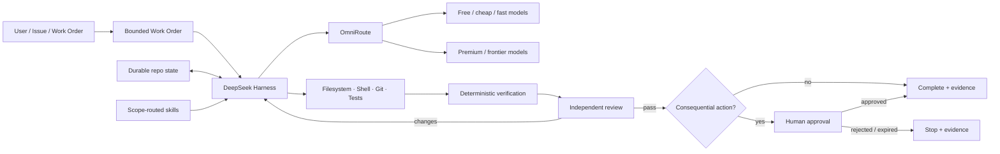

# Free Autonomous Engineering Setup

[Deutsch](README.de.md) · [Architecture](docs/ARCHITECTURE.md) · [Installation](docs/INSTALLATION.md) · [Routing](docs/ROUTING.md) · [Security](docs/SECURITY-AND-AUTHORITY.md) · [Costs](docs/COSTS.md)


> A local-first, free-preferred autonomous coding control plane built around **DeepSeek Harness + OmniRoute + GitHub-backed durable engineering state**.

This repository combines the strongest reusable engineering patterns from [`WestMoneyDE/ai-engineering-stack`](https://github.com/WestMoneyDE/ai-engineering-stack) and [`WestMoneyDE/LOGOS-1`](https://github.com/WestMoneyDE/LOGOS-1) with [`deepseek-ai/deepseek-harness`](https://github.com/deepseek-ai/deepseek-harness) as the coding runtime and [`diegosouzapw/OmniRoute`](https://github.com/diegosouzapw/OmniRoute) as the model gateway.

The goal is not “one magic free model.” The goal is a **vendor-neutral engineering system** that routes work across available models, preserves project state outside chat, verifies its own changes, escalates risk, and can operate at **$0 API spend when the selected provider path is actually free**.

## What this setup changes

Traditional agent coding usually couples the agent runtime, model provider, session memory, and authority into one product. This setup deliberately separates them:

| Layer | Responsibility |
|---|---|
| **DeepSeek Harness (`dsh`)** | Agent loop, coding tools, sessions, plugins, filesystem/shell interaction |
| **OmniRoute** | OpenAI-compatible gateway, model/provider routing, health/quota/cost/latency selection, fallback |
| **Repository contract** | Work orders, durable state, evidence, memory provenance, review and authority rules |
| **GitHub** | Source of truth, history, branches/PRs, CI, durable checkpoints |
| **Human authority** | External, destructive, production, financial, legal, or otherwise consequential actions |

## Architecture



See [docs/ARCHITECTURE.md](docs/ARCHITECTURE.md) for the control-plane boundaries.

## Best features carried forward

From **AI Engineering Stack**:

- bounded **plan → build → verify → independent review → gate** loops;
- deterministic evidence before completion;
- allow / ask / deny permission classes;
- least-privilege connectors and secret-path protection;
- independent security review instead of builder self-approval;
- provider failure as explicit state rather than fabricated success;
- durable project state instead of chat-only memory;
- scope-routed, source-pinned skills;
- append-oriented auditability, idempotency and fail-closed AI patterns.

From **LOGOS-1**:

- **capability is not authority**;
- working, episodic, semantic, procedural and evidence memory are distinct concerns;
- governance/assurance state stays outside adaptive agent memory;
- provenance, uncertainty, conflicts and supersession survive retrieval/consolidation;
- unknown remains unknown;
- failures are persisted exactly instead of narrated away;
- one coherent prepared push is preferred over corrective push chains;
- external execution is one-shot by default: no automatic rerun of a failed external action without a new explicit instruction and materially changed prerequisite;
- every substantive session leaves enough durable evidence for a fresh agent to resume without the old chat.

## Routing profiles

OmniRoute already exposes useful virtual routes. Recommended defaults for this setup:

| Intent | OmniRoute model |
|---|---|
| Normal coding | `auto/coding` |
| Fast repository search / small fixes | `auto/coding:fast` |
| Cost-sensitive coding | `auto/coding:cheap` |
| Reliability-sensitive coding | `auto/coding:reliable` |
| Free-preferred coding | `auto/coding:free` |
| Hard reasoning / architecture | `auto/reasoning:pro` |

**Important:** OmniRoute category/tier filtering is fail-open when no candidate satisfies the filter. Therefore `auto/coding:free` is **free-preferred, not a hard $0 guarantee**. For a hard-spend policy, isolate the permitted no-cost candidates and/or use strict request-budget enforcement in clients that can send OmniRoute budget headers. See [docs/ROUTING.md](docs/ROUTING.md).

## Quick start

### Requirements

- Git
- Node.js 20+ recommended by this starter
- npm / npx

Clone and validate the repository:

```bash
git clone https://github.com/WestMoneyDE/free-autonomous-engineering-setup.git
cd free-autonomous-engineering-setup
npm test
```

Run the bootstrap preflight. It is dry-run only unless `--apply` is given:

```bash
bash scripts/bootstrap.sh
```

PowerShell:

```powershell
pwsh -File scripts/bootstrap.ps1
```

### 1. Start OmniRoute

No global install is required:

```bash
npx omniroute
```

The local OpenAI-compatible endpoint is:

```text
http://localhost:20128/v1
```

Check the model catalog:

```bash
curl http://localhost:20128/v1/models
```

Optional global installation:

```bash
npm install -g omniroute
omniroute --version
omniroute setup
```

### 2. Start DeepSeek Harness

In another terminal:

```bash
npx @deepseek-ai/dsh web
```

The local Web UI opens on:

```text
http://127.0.0.1:3080
```

DeepSeek Harness is currently a **developer preview** and upstream explicitly warns that compatibility-breaking changes will occur. Review upstream changes before unattended production use.

### 3. Add OmniRoute to DeepSeek Harness

In DSH open **Settings → Models → Add a custom provider** and use:

```text
Provider ID: omniroute
Base URL:    http://127.0.0.1:20128/v1
Protocol:    openai-completions
API key:     dummy-key          # local quickstart only
Model:       auto/coding
```

For configuration-as-code, merge [`config/dsh-omniroute.settings.example.yaml`](config/dsh-omniroute.settings.example.yaml) into your DSH settings. Do **not** overwrite an existing DSH settings file blindly.

Then select `omniroute / auto/coding` for a new DSH session.

Full instructions: [docs/INSTALLATION.md](docs/INSTALLATION.md).

## Engineering operating model

Every non-trivial task should be represented as a bounded work order:

```text
INTENT
  ↓
WORK ORDER
  ↓
CLASSIFY RISK + ROUTE
  ↓
PLAN
  ↓
BUILD
  ↓
VERIFY
  ↓
INDEPENDENT REVIEW
  ↓
HUMAN GATE IF CONSEQUENTIAL
  ↓
CHECKPOINT + COMPLETE
```

Use [`templates/WORK-ORDER.md`](templates/WORK-ORDER.md) and [`templates/SESSION-REPORT.md`](templates/SESSION-REPORT.md). The rules agents must follow are in [`AGENTS.md`](AGENTS.md).

## Memory model

The repository is the durable project truth. Agent memory may accelerate retrieval, but it may not become the only copy of a decision or create authority.

Recommended logical stores:

```text
.state/
  tasks/       # active and historical work orders
  sessions/    # checkpoints and resumable run state
  evidence/    # test output, review summaries, source pins, hashes
  decisions/   # accepted architecture and policy decisions
  memory/      # provenance-bearing agent/project memory
  assurance/   # separate authority/governance state; not agent-writable
```

See [docs/MEMORY-AND-STATE.md](docs/MEMORY-AND-STATE.md).

## Safety defaults

**Allow autonomously:** local reads, search, planning, code edits in task scope, formatting, tests, static analysis, reversible local operations.

**Ask first:** push/merge, deployment, production writes, external messages, payments, account changes, infrastructure mutation, destructive data operations, legal/financial external effects.

**Deny by default:** secret exfiltration, permission bypass, forceful history destruction, self-granted authority, disabling required safety controls, unrestricted self-copying or persistence.

The builder never approves its own consequential action. See [docs/SECURITY-AND-AUTHORITY.md](docs/SECURITY-AND-AUTHORITY.md).

## Cost model

The software in this composition can be run locally without a license fee. **Model usage may still cost money.** A $0 API-cost path exists only while the actual routed providers/models are free and within their quotas. Free tiers and provider terms change over time.

See [docs/COSTS.md](docs/COSTS.md) for hard/soft budget patterns.

## Repository map

```text
.
├── AGENTS.md
├── assets/
│   └── free-autonomous-engineering-setup-hero.jpg
├── config/
│   ├── .env.example
│   └── dsh-omniroute.settings.example.yaml
├── docs/
│   ├── ARCHITECTURE.md
│   ├── COSTS.md
│   ├── INSTALLATION.md
│   ├── MEMORY-AND-STATE.md
│   ├── OPERATING-MODEL.md
│   ├── ROUTING.md
│   ├── SECURITY-AND-AUTHORITY.md
│   └── UPSTREAMS.md
├── scripts/
│   ├── bootstrap.ps1
│   ├── bootstrap.sh
│   └── verify-repo.mjs
├── templates/
│   ├── SESSION-REPORT.md
│   └── WORK-ORDER.md
└── .github/workflows/validate.yml
```

## Upstream status

This starter was validated against the public upstream documentation available on **2026-08-20**. OmniRoute and especially DeepSeek Harness move quickly. Revalidate the integration before upgrading. See [docs/UPSTREAMS.md](docs/UPSTREAMS.md).

## License

MIT. Third-party projects retain their own copyrights and licenses. This repository does not vendor their source code; it supplies an integration architecture, operating contract, configuration examples and documentation. See [NOTICE.md](NOTICE.md).
