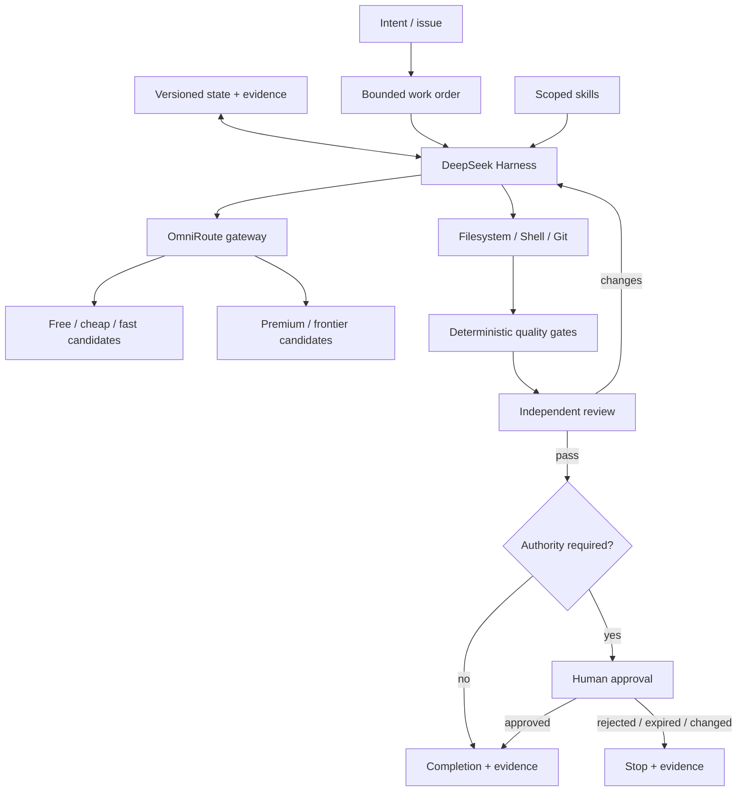

# Architecture

## Design objective

Build an autonomous coding environment where the **agent runtime, model routing, project truth, verification and authority are separate control boundaries**.

The separation is intentional: an LLM can be capable without becoming authoritative; a memory system can be useful without becoming a permission system; a router can optimize cost without being allowed to silently violate a budget policy.

## Control-plane view



## Responsibility boundaries

### DeepSeek Harness — execution plane

Use DSH for the coding-agent lifecycle: sessions, agent loop, tools, filesystem/shell interaction and plugins. DSH may request an LLM through OmniRoute, but it does not become the source of project truth or authority.

### OmniRoute — inference routing plane

Use OmniRoute as the single LLM endpoint. It owns provider/model selection, provider health, quota/cost/latency signals, fallback and routing profiles. It should not own work-order state, business truth or approval policy.

### Repository — truth and recovery plane

Git-backed files own:

- work orders and acceptance criteria;
- architecture decisions;
- session checkpoints;
- verification/review evidence;
- durable memory with provenance;
- explicit capability and policy changes.

Chat history and runtime-local auto-memory are accelerators, not the only copy of important state.

### Deterministic verification — evidence plane

Tests, typecheck, lint, static analysis, security scans, schema checks and targeted evals produce evidence. Model text does not substitute for these checks.

### Authority — governance plane

A model can propose an effect but cannot approve itself. Permission is an external fact bound to a scope/action/target/version/time window. Changed content or stale approval invalidates the grant.

## Engineering loop

```text
REQUEST
  ↓
WORK ORDER
  ↓
RISK + ROUTE CLASSIFICATION
  ↓
PLAN
  ↓
BUILD
  ↓
VERIFY
  ↓
INDEPENDENT REVIEW
  ↓
AUTHORITY GATE
  ↓
CHECKPOINT / COMPLETE
```

A loop has bounded exit states: verified completion, explicit stop, provider wait/failure, blocker, or human gate. Endless retry is not a valid state.

## Fail-closed rules

- Invalid/missing structured output → fail, do not infer success.
- Provider unavailable → wait/fail; never fabricate a response.
- Verification unavailable → completion remains unverified.
- Approval absent/stale/mismatched → deny the consequential action.
- Memory conflict → surface the conflict; do not silently merge it into certainty.
- Budget policy cannot be satisfied → stop or choose a specifically permitted fallback; never silently overspend.

## Extension boundaries

MCP/connectors, skills and plugins are optional extension surfaces. They must not own authoritative workflow state. Start connectors read-only, grant mutation narrowly, and keep credentials outside Git.

## Why this is more robust than a single coding CLI

A single vendor CLI often bundles agent behavior, model selection and runtime state. This architecture makes each component replaceable:

- DSH can be upgraded/replaced without rewriting durable project state.
- OmniRoute can change providers/models without changing agent workflows.
- New memory retrieval can be added without changing authority semantics.
- Verification gates can reject bad model output regardless of which model produced it.
- Git retains a human-auditable history across model/provider outages.
