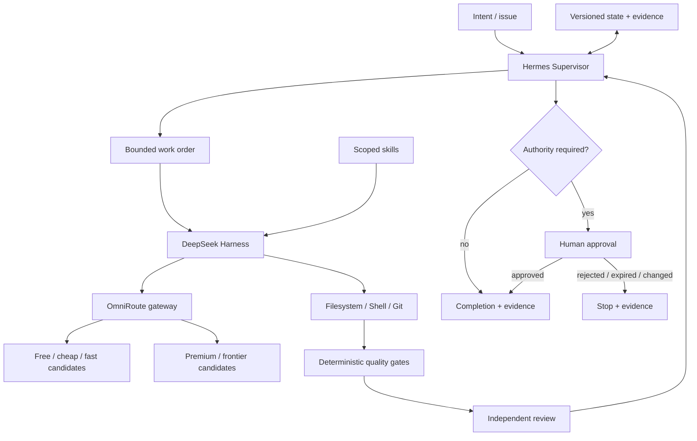

# Architecture

## Design objective

Build an autonomous engineering environment where **supervision, coding execution, inference routing, project truth, verification and authority are separate control boundaries**.

## Control-plane view



## Responsibility boundaries

### Hermes Supervisor — supervision plane

Hermes is the external supervisor. It owns work-order orchestration, compact project-state reads, state transitions, worker dispatch, duplicate-run locks, escalation and human-gate routing. It should not be the primary code writer and should not contain a competing provider router.

Hermes primarily consumes a compact durable interface such as `brain/STATE.json`, `CURRENT-WORK-ORDER.md` and versioned session/evidence records. It should avoid reconstructing the project from full-repository reads on every cycle.

Recommended transitions:

```text
READY → implementation worker
READY_FOR_REVIEW → independent reviewer
CHANGES_REQUESTED → implementation worker
BLOCKED / WAIT_PROVIDER → stop or bounded wait
FOUNDER_REQUIRED → human authority
APPROVED_FOR_EXTERNAL_ACTION → exact one-shot action
DONE → checkpoint and close
FAIL / CANCELLED → persist exact outcome
```

See `HERMES-SUPERVISOR.md`.

### DeepSeek Harness — execution plane

Use DSH for the coding-agent lifecycle: agent loop, sessions, tools, filesystem/shell/Git interaction and plugins. DSH receives bounded tasks from Hermes and returns structured results/evidence. It does not become the source of project truth or authority.

### OmniRoute — inference routing plane

Use OmniRoute as the single LLM endpoint. It owns provider/model selection, health, quota/cost/latency signals, fallback and routing profiles. Hermes may choose a task routing class/policy envelope, but OmniRoute selects the concrete model/provider.

### Repository — truth and recovery plane

Git-backed files own work orders, architecture decisions, state transitions, checkpoints, verification/review evidence, durable memory with provenance and explicit policy changes. Chat history and runtime-local auto-memory are accelerators, not the only copy of important state.

### Deterministic verification — evidence plane

Tests, typecheck, lint, static analysis, security scans, schema checks and targeted evals produce evidence. Model text does not substitute for these checks.

### Authority — governance plane

A capable supervisor or worker cannot approve itself. Permission is an external fact bound to scope/action/target/version/time. Changed content or stale approval invalidates the grant.

## Engineering loop

```text
REQUEST
  ↓
HERMES: BOUND + CLASSIFY + DISPATCH
  ↓
DSH: PLAN + BUILD
  ↓
OMNIROUTE: INFERENCE ROUTING
  ↓
VERIFY
  ↓
INDEPENDENT REVIEW
  ↓
HERMES: STATE TRANSITION
  ↓
AUTHORITY GATE
  ↓
CHECKPOINT / COMPLETE
```

## Supervisor invariants

- One active worker lease per project/work-order/phase.
- A worker proposes state transitions; Hermes validates and persists them.
- Hermes does not infer approval from model confidence, memory or prior successes.
- Repeated worker failure triggers diagnosis/escalation, not infinite loops.
- Provider failure is `WAIT_PROVIDER`/`FAIL`, never fabricated completion.
- Consequential external execution is one-shot by default.

## Why the separation matters

- Hermes can evolve without changing worker/model internals.
- DSH can be replaced without rewriting durable project state.
- OmniRoute can change providers/models without changing workflow semantics.
- Memory can improve retrieval without becoming authority.
- Verification gates reject bad output regardless of model/provider.
- Git retains a human-auditable history across runtime/provider outages.
